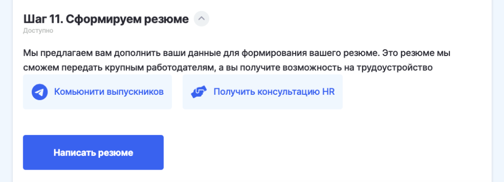

# Добро пожаловать во Flow!


_<mark style="color:green;"><mark style="color:blue;">Благодарим за заявку на участие в федеральном проекте «Содействие занятости». В скором времени Вам откроется доступ в систему Flow. Это Личный кабинет гражданина, в котором Вы найдете информацию о том, как успешно пройти все этапы участия в проекте — от подачи заявки до обучения и оформления занятости.<mark style="color:blue;"></mark>_



После подачи заявки на портале [Работа в России](https://trudvsem.ru) обычно в течение часа на адрес электронной почты, указанный в заявке, приходит [ссылка](voprosy/ssylka-nedeistvitelna.-chto-delat.md) для входа в кабинет Flow.  Проверяйте также дополнительный адрес.\
\
Адрес почты, с которого придет письмо, **info@tgu-dpo.ru.**

Время получения письма может увеличиться, если накопилась большая очередь из заявок.



В личном кабинете следует по шагам выполнять инструкцию.&#x20;

Выполнение одного шага позволит вам перейти к следующему.&#x20;


.png>)

## Шаг 1. Включите уведомления

Важным условием для своевременного заполнения данных и предоставления уведомлений являются уведомление. Поэтому на шаге 1 они будут включены автоматически, чтобы  Вы не пропустили важную информацию.

## Шаг 2. Уточните данные

Данный шаг  будет открыт для вас сразу после входа в личный кабинет. Внимательно проверьте и дополните информацию о себе.&#x20;

Ф.И.О. в дательном падеже необходимо будет для последующего заполнения заявления и выдачи документа о квалификации после завершения обучения.

**Фактический адрес** заполняется для последующей отправки документа о квалификации после завершения обучения. Если Ваш фактический адрес совпадает с адресом регистрации, отметьте галочку и адрес будет перезаписан. Если не совпадает, внесите действующий адрес проживания. На шаге 10 в случае переезда вы сможете указать новый адрес доставки.

Загрузите **фото** и  **скан-копии 2 страниц паспорта**:

* главная страница
* страница регистрации

> [**Как сканировать с телефона? Научитесь 1 раз и пользуйтесь всегда!!!**](voprosy/kak-skanirovat-s-telefona.md)
>
> [**Посмотреть видео для IPhone**](https://youtu.be/IH4WJ5NxcrY)**.**


**Оба окна для загрузки страниц паспорта должны быть заполнены.** &#x20;

При вводе кода подразделения в графе паспорта, поле кем выдано заполнялось автоматически.



Если страницы паспорта находятся в одном файле pdf,  воспользуйтесь [онлайн-сервисом](https://www.ilovepdf.com/ru/split\_pdf) для разделения pdf и загрузите каждую страницу в своё окно.



**ИНН** будет заполнен автоматически, просто проверьте его.



#### Заполните "Сведения о трудовой деятельности".  Не оставляйте поле пустым, оставьте "Отсутствует", если не работаете.



**Сканы или фотографии документов  должны быть хорошего качества,** иначе при проверке документов вас могут попросить загрузить их повторно, и обработка вашей заявки в образовательной организации затянется.&#x20;


Если вы не знаете, как сканировать документы самостоятельно, можно использовать [подсказку](voprosy/kak-skanirovat-s-telefona.md).

.png>)

&#x20;Нажмите кнопку "Сохранить", чтобы перейти к **шагу 3**.

## Шаг 3. Проверьте  образование

* Выберите уровень образования.
* Заполните сведения о дипломе/документе об образовании.&#x20;
  * Если диплом на иностранном языке - включите настройку и добавьте документ о признании образования на территории РФ и нотариальный перевод.
  * Если вы изменяли фамилию - включите настройку и приложите документ  о смене фамилии.


Если у вас пока нет диплома, но вы студент последнего курса и получите диплом до даты окончания обучения - справку с места учёбы.

Если для вашей программы не обязательно высшее образование - документ, подтверждающий уровень образования (например, школьный аттестат).


 (1).png>)

Для перехода **к шагу 5**  необходимо дождаться, когда все загруженные документы проверит представитель вашего университета, и вы **получите  подтверждение ЦЗН о том, что ваша заявка одобрена**.&#x20;


Возможно, представители вашего университета  попросят вас заменить нечеткие сканы документов.  После замены сканов также необходимо дождаться проверки для перехода  к следующему шагу.


## Шаг 4.  Проверьте документы

Ваши документы проверяет представитель вашего университета. Параллельно ваша заявка проверяется в ЦЗН.&#x20;

.png>)


**Важно!! Если ваша заявка одобрена, но пока вы не видите доступного периода обучения, необходимо регулярно заходить в личный кабинет (каждый день), чтобы выбрать доступный период, когда его добавит образовательная организация.**\
**Часто число студентов на каждый из периодов ограницено и вы можете не успеть выбрать доступный и придется либо ожидать следующий (если ваша заявка ещё не истекла), либо отменять заявку и подавать новую.**


## Шаг 5. Выберите период обучения

Ваши документы проверены. Заявка в ЦЗН подтверждена. Теперь вам следует выбрать:

\
**1. Тип договора**:

* Двусторонний на самозанятость.
* Трехсторонний **с работодателем**. Гражданин заранее знает, к какому работодателю он будет трудоустроен или уже трудоустроен. Отнести договоры (3 копии) на подпись работодателю гражданин должен **самостоятельно**. \
  [Подробнее о выборе типа договора.](https://informa.gitbook.io/flow-kabinet-grazhdanina/shag-5.-problemy-i-voprosy#kakoi-tip-dogovora-mne-vybrat)


**Внимательно выбирайте тип договора! Если вы перейдёте к шагу 6, изменить выбранный тип будет возможно, но мы не гарантируем наличие свободных мест и доступность выбранного периода обучения.**



Ознакомьтесь с подсказками по договорам, чтобы выбрать верный тип.



Для категории участников **Безработные**  доступен только 1 тип договора -  **Трёхсторонний с ЦЗН** - этот тип определён  автоматически и изменить его нельзя.


**2. Период обучения:**

По вашей образовательной программе может быть 1 или несколько периодов обучения, выберите подходящий.&#x20;

.png>)

Подробнее по какой схеме вам доступен период обучения.

### Пример пятидневной рабочей недели (без праздничных выходных)

1. старт потока в **понедельник** следующей недели:&#x20;
   1. гражданин **выбирает** поток **до среды включительно**,
   2. **загружает** документы **до четверга включительно**;&#x20;
   3.  документовед проверяет **до пятницы включительно;**

2.  старт потока во **вторник**:&#x20;

    1. гражданин **выбирает** поток **до четверга включительно**,&#x20;
    2. **загружает** документы **до воскресенья включительно**;&#x20;
    3. документовед проверяет **до понедельника включительно**;

3.  старт потока в **среду**:

    1. &#x20;гражданин **выбирает** поток **до воскресенья включительно**,&#x20;
    2. **загружает** документы **до понедельника включительно**;
    3. &#x20;документовед проверяет **до вторника включительно**;

4.  старт потока в **четверг**:&#x20;

    1. гражданин **выбирает** поток **до понедельника включительно**,&#x20;
    2. **загружает** документы до вторника включительно;&#x20;
    3. документовед проверяет **до среды включительно**;

5.  старт потока в **пятницу**:&#x20;

    1. гражданин **выбирает** поток **до вторника включительно**,&#x20;
    2. **загружает** документы **до среды включительно**;
    3. &#x20;документовед проверяет **до четверга включительно**;

6.  старт потока в **субботу**:&#x20;

    1. гражданин **выбирает** поток **до среды включительно**,
    2. &#x20;загружает документы **до четверга включительно**_;_&#x20;
    3. документовед проверяет **до пятницы включительно**;

7. старт потока в **воскресенье**:
   1. &#x20;гражданин **выбирает** поток до среды **включительно**,&#x20;
   2. **загружает** документы **до четверга включительно**;&#x20;
   3. документовед проверяет **до пятницы включительно**.&#x20;

###

### Выбор доступного периода обучения для граждан категории Безработные

1\. **До того, как ЦЗН одобрит заявку** гражданину категории “безработные”:\
\- может выбрать поток на 5 шаге;\
\- скачать сгенерированные бланки на 6 шаге;\
\- загрузить документы на зачисление на 6 шаге.

2\. Потоки, которые будут отображаться для выбора на 5 шаге, должны стартовать:\
\- не ранее, чем через 7 рабочих дней от текущей даты и\
\- не позже, чем через 30 рабочих дней после **даты подачи заявки**.

Описанные выше условия действуют, если заявка гражданина категории "Безработные" находится в статусе "На рассмотрении" в ЦЗН.

## Шаг 6. Заключение договора

Скачайте **Договор**, **Согласие на обработку данных** и **Заявление на зачисление** по кнопке "Скачать" - отдельная кнопка  для каждого документа.

Заполните  данные **ручкой**,  отсканируйте и отправьте на проверку. Важно, что каждый документ необходимо загружать в своё окно. [Как сканировать  документы](voprosy/kak-skanirovat-s-telefona.md)?

Возможно документа будет 4, в этом случае четвертый документ так же необходимо скачать и подписать.


**Распечатывайте  договор в двух/трех экземплярах! В университет вы оправляете:**

&#x20;       **2 копии договора, если договор двусторонний;**

&#x20;       **3 копии договора, если договор трёхсторонний.**&#x20;


 (1).png>)

Для категории Безработные граждане, зарегистрированные в ЦЗН поля с реквизитами цЗН будут предзаполнены, но вы можете изменить эти данные на корректные . Узнать точные данные для заполнения вы можете  после посещения ЦЗН, в договоре ручкой ЦЗН пропишет свои реквизиты.&#x20;

<figure><figcaption></figcaption></figure>

## Шаг 7. Проверка договора

.png>)

Пример письма на почту

 (1).png>)

## Шаг 8. Отправка оригиналов документов


Договор считается заключенным, если на нем есть подпись всех сторон, поэтому отправлять оригиналы  - это обязательное условие для участников проекта по Содействию занятости.


Вам необходимо направить в университет **четыре/пять** документов.


* **Договор**, распечатанный  в **2-х** экземплярах (один, подписанный университетом  экземпляр, вернётся вам)/ в **3-х** экземплярах (если вы выбрали тип договора  трёхсторонний)
* **Согласие на обработку персональных данных**
* **Заявление на зачисление**
* **Согласие о переносе сроков обучения (если оно доступно для скачивания).**


### Для передачи в университет  возможны 2 способа:

* принести лично (поставьте прочерк в поле для ввода трек-номера), если ваша образовательная организации  это допускает
* отправить по почте.  **Предпочтительнее**. При выборе данного способа в личном кабинете  заполните:
  * трек номер письма;
  * дату отправки;
  * при необходимости оставьте комментарий.


**При отправке укажите, пожалуйста, на конверте название вашей программы.**

**Почтовый адрес вашей образовательной организации указан в договоре.**


<figure><figcaption></figcaption></figure>

За сутки до даты старта потока, вы получите письмо-приглашение в Odin и сможете войти на платформу, где будет проходить обучение. Вход также допустим по логину - адрес электронной почты, указанный при подаче заявки и паролю (инструкция по установке пароля также придет в письме приглашении с адреса noreply@odin.study).&#x20;


На этом шаге в личном кабинете у вас пропадёт кнопка "Отменить заявку"(будет заменена на кнопку "Заявление на отчисление"), и если по каким-то причинам вы не хотите продолжать обучение, необходимо будет написать [**заявление на отчисление по собственному желанию**.](voprosy/kak-otmenit-zayavku.md)

**Очень важно! Отчислится за проект вы сможете только 1 раз, если вы после отчисления подадите заявку и приступите к обучению, то повторое отчисление = потере права на участие в проекте.**



**После подтверждения заявления на отчисление подать заявку можно только после даты завершения обучения в потоке, где вы должны были учится + 3 дня.**


## Шаг 9. Обучение

Вы можете приступить к обучению. Обучение будет проходить на платформе [Odin](http://localhost:5000/s/WRKfIWXs8CN7zTlPN8M4/). &#x20;

Вы сможете войти на образовательную платформу сразу из ЛК гражданина, познакомиться с системой, где проводит обучение ваша образовательная организация, и приступить к нему.

Ваш приказ на зачисление загружает университет. Может потребоваться некоторое время, чтобы вы увидели приказ и смогли его скачать.

.png>)

## Шаг 10. Завершим обучение

Шаг 10 будет открыт за 14 календарных дней до момента окончания обучения.

На шаге 10 гражданину становится доступен опрос о качестве и появляется возможность проверить/внести изменения  в адрес, куда будет доставлен документ о квалификации при успешном завершении обучения. &#x20;

<figure><figcaption></figcaption></figure>

По кнопке "Ваши документы вам после добавления вам будет доступен скан приказа об отчислении" и документы о квалификации.

## Шаг 11. Сформируем резюме

На данном шаге вы можете заполнить информацию по вашему резюме. После отправки резюме дополнительных действий не требуется. Оно будет сохранено автоматически.&#x20;

<figure><figcaption></figcaption></figure>

Просмотр резюме будет доступен после доработки шага 11. &#x20;

## Шаг 12. Успех

После завершения обучения информация о вашем трудоустройстве автоматически поступит в ЛК гражданина с портала Работа в России, после подтверждения вашего трудоустройства  шаг 12 будет открыт. Получение информации о вашем трудоустройстве может занять некоторое время после завершения обучения.

<figure><figcaption></figcaption></figure>
