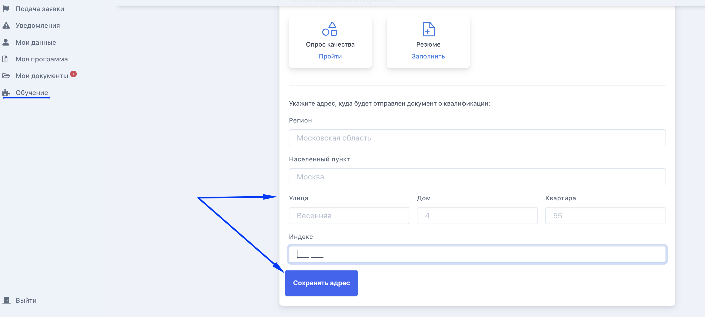

# Если я переехал во время обучения

Если гражданин во время обучения переехал, то в личном кабинете следуюет заполнить новый адрес для отправки документов.&#x20;

Если адрес уже не получается изменить, значит, отправка документов уже запланирована в вашей образовательной организации. В этом случае следуюет связаться с куратором или преподавателем и уточнить, как получить документы на новый адрес.

<figure><figcaption></figcaption></figure>

