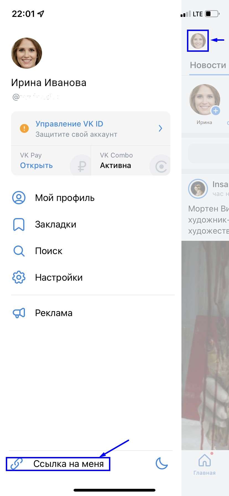

# 🤳 Где найти ссылку на мою страницу ВКонтакте?

Для получения ссылки ВКонтакте с **компьютера**:

1. кликните на раздел "Моя страница" (первый пункт в боковом меню).
2. нажмите кнопку "Ссылка на профиль" или скопируйте ссылку из адресной строки браузера. Для этого щелкните правой кнопкой мыши по ссылке и выберите в меню пункт “Копировать”.&#x20;

Вы получите ссылку, ведущую на вашу страницу. Как правило, она выглядит так: http(s)://vk.com/id\*.

Для получения ссылки ВКонтакте с **телефона**:

1. на Главной странице нажмите на ваш аватар в левом верхнем углу.&#x20;
2. нажмите кнопку "Ссылка на меня".  (Вставить с телефона посте копирования возможно, зажав пальцем на поле для ввода текста, в появившемся меню необходимо выбрать  пункт "Вставить".)

&#x20;                                              

Вставьте полученную ссылку в[ ЛК гражданина](https://lk.tgu-dpo.ru/) в поле ВК и нажмите "Сохранить".

.png>)
